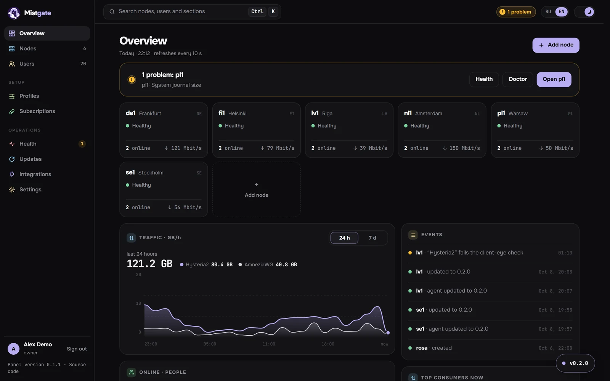
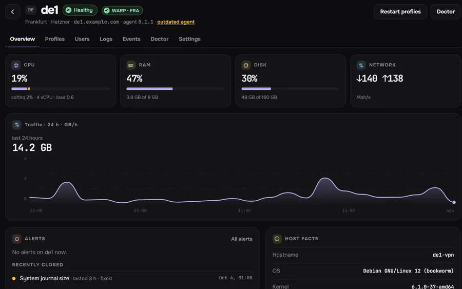
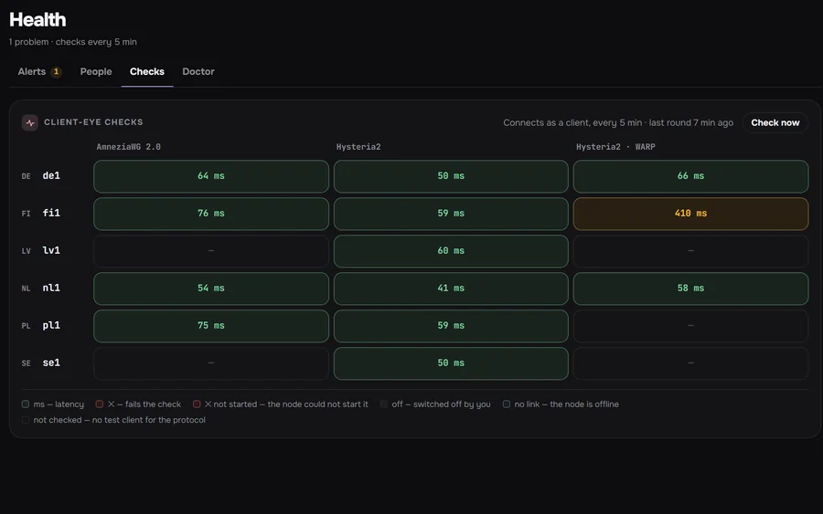
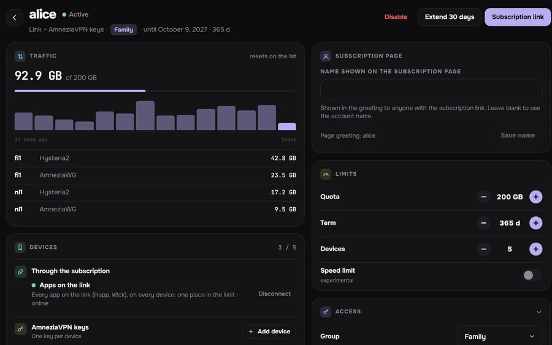
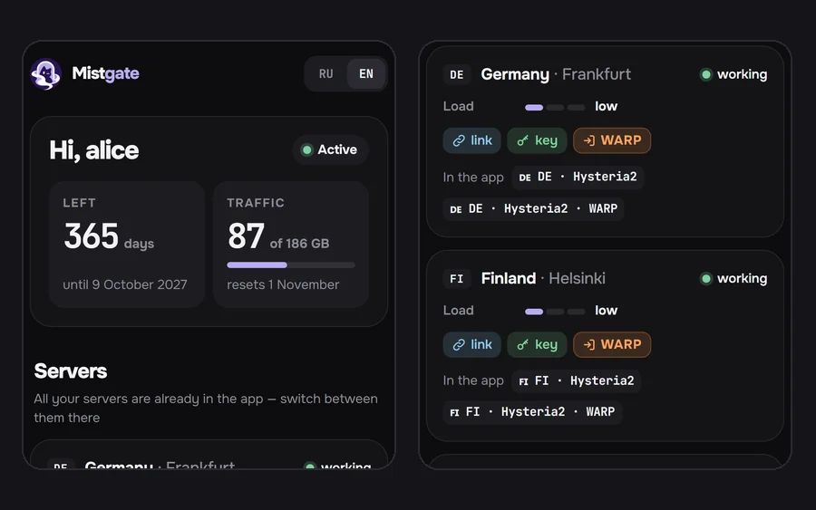

<div align="center">


<h1>Mistgate</h1>

<h3>Your own VPN for your people, without babysitting servers.</h3>

<p>For family, friends, a community or a small team.<br>
Hysteria2 and AmneziaWG on your own servers, VLESS REALITY on the way: add a server from the browser, give each person one link, and hear about an outage first.</p>

<p>
<a href="https://github.com/Mistgate/mistgate/releases/latest"></a>
<a href="LICENSE"></a>
<a href="https://github.com/Mistgate/mistgate/actions/workflows/ci.yml"></a>
<a href="go.mod"></a>
</p>

<p><a href="https://mistgate.app/"><b>Docs</b></a> · <a href="#quick-start"><b>Install</b></a> · <a href="#screenshots"><b>Screenshots</b></a> · <a href="#compared-with-other-panels"><b>Compare</b></a> · <a href="README.ru.md">Русский</a></p>

</div>

<picture>
  <source media="(prefers-color-scheme: dark)" srcset="docs/images/readme/overview-dark-en.webp">
  <source media="(prefers-color-scheme: light)" srcset="docs/images/readme/overview-light-en.webp">
  
</picture>

## Why Mistgate

Mistgate is for people who run a VPN for others: family, friends, a community or a small team. You install one panel, add servers to it, and send each person a link. The panel then keeps the servers configured and checked.

**One link per person, several protocols.**
Apps on the Clash/Mihomo core (kl!ck, FlClash, Clash Verge Rev) get the Hysteria2 and the AmneziaWG servers from the same link, so when one protocol is blocked on someone's network, the other is already in their app. Happ gets the Hysteria2 servers; AmneziaVPN gets a key per device from the person's page. [Client apps](docs/en/guide/client-apps.md)

**Add a server from the browser.**
Type its IP and root password. The panel pins the SSH host key, checks the server, opens the ports in an active UFW or firewalld, installs the signed agent and waits for it to connect. The node gets its Let's Encrypt certificate itself, and **Enable WARP** gives it a Cloudflare exit. [Install a node over SSH](docs/en/getting-started/ssh-install.md)

**You find out first.**
Every 5 minutes the panel connects to every server the way an app does and loads a test page through the tunnel. On each node a doctor runs 16 host checks (disk, journal, resolver, clock, ports, BBR) and offers five fixes that run only after you confirm. Warnings go to Telegram. [Health](docs/en/operations/health.md)

**Light and hidden.**
Two static Go binaries, one for the panel and one for the node agent. SQLite and systemd: no Docker, no database server. On the author's own install the panel uses about 150 MB of RAM on a 1 vCPU / 1 GB VPS, serving 16 people and 4 nodes. A stranger who opens the panel's address sees a decoy site; the admin sits behind a secret path or host name. Releases are reproducible and signed offline, and nodes install only signed builds. Torrent protection blocks plaintext BitTorrent on the node; its events keep what matched and the destination port, and no address leaves the node. [Security](docs/en/operations/security.md) · [Releases and signing](docs/en/operations/releases.md)
<!-- TODO(benchmarks): replace the one-install figure with benchmark results (panel and node RSS, idle and under load, next to other panels) once they exist. -->

**Let your AI agent help.**
The panel has a built-in MCP server. Claude Code, Codex or another agent reads the fleet and changes it through plan → apply. Installing a node, a doctor fix or a server password change waits until you approve it in the admin. Agents never receive subscription links, device keys or passwords. [AI agent guide](docs/en/getting-started/ai-agents.md) · [MCP](docs/en/reference/mcp.md)

> **Coming soon, not in a release yet:** VLESS REALITY and XHTTP (the node engine is merged), Xray JSON and sing-box subscriptions, a one-line installer, a full Telegram bot for the fleet and for users, and a free edition of the panel that runs on Cloudflare Workers (in development).

## Screenshots

<table>
<tr>
<td width="50%"><picture><source media="(prefers-color-scheme: dark)" srcset="docs/images/readme/node-dark-en.webp"><source media="(prefers-color-scheme: light)" srcset="docs/images/readme/node-light-en.webp"></picture><br><sub><b>A node.</b> Status, WARP exit, load and 24 hours of traffic.</sub></td>
<td width="50%"><picture><source media="(prefers-color-scheme: dark)" srcset="docs/images/readme/health-dark-en.webp"><source media="(prefers-color-scheme: light)" srcset="docs/images/readme/health-light-en.webp"></picture><br><sub><b>Client-eye checks.</b> Every protocol on every node, latency through the tunnel.</sub></td>
</tr>
<tr>
<td width="50%"><picture><source media="(prefers-color-scheme: dark)" srcset="docs/images/readme/user-dark-en.webp"><source media="(prefers-color-scheme: light)" srcset="docs/images/readme/user-light-en.webp"></picture><br><sub><b>A person.</b> Quota, term, devices and the traffic that counts against the quota.</sub></td>
<td width="50%"><picture><source media="(prefers-color-scheme: dark)" srcset="docs/images/readme/phone-dark-en.webp"><source media="(prefers-color-scheme: light)" srcset="docs/images/readme/phone-light-en.webp"></picture><br><sub><b>Their link in a browser.</b> Days left, traffic and their servers.</sub></td>
</tr>
</table>

The screenshots use invented demo data.

## Quick start

You need a Linux server (amd64 or arm64) with systemd, a domain that points at it (here `panel.example.com`), and TCP ports 80 and 443 free. On the server, as root:

```sh
ARCH=amd64    # arm64 on an ARM server
for f in "mistgate-linux-$ARCH" SHA256SUMS; do
  curl -fsSLO "https://github.com/Mistgate/mistgate/releases/latest/download/$f"
done
sha256sum --check --ignore-missing SHA256SUMS
install -m 0755 "mistgate-linux-$ARCH" /usr/local/bin/mistgate
mistgate setup --public-url https://panel.example.com             # prints the admin URL and a one-time setup link
mistgate serve --listen :443 --acme-domain panel.example.com      # a first run in the foreground
```

Then:

1. Run `serve` under systemd with the unit from [Install the panel](docs/en/getting-started/install-panel.md). That page also covers the hidden admin host, your own certificate and your own decoy site.
2. Open the setup link and create the owner: a passkey, or a password with an authenticator code.
3. Add servers in **Nodes → Add node**, over SSH or with a one-time command ([Add a node](docs/en/getting-started/add-node.md)), then follow [First users](docs/en/getting-started/first-users.md).

**Or let an AI agent install it.** Claude Code, Codex CLI or any agent that can run `ssh` on your computer can do the steps above: copy the install prompt from the [AI agent guide](docs/en/getting-started/ai-agents.md#install-mistgate-with-an-ai-agent). It asks before every change, and you create the owner account yourself.

## Compared with other panels

| | Mistgate | 3x-ui | Remnawave | Hiddify | PasarGuard | s-ui |
|:--|:--|:--|:--|:--|:--|:--|
| Runs without Docker | ✅ | ✅ | ❌ | ✅ | partial | ✅ |
| Database | SQLite | SQLite or PostgreSQL | PostgreSQL + Redis | MySQL + Redis | SQLite, MySQL, MariaDB or PostgreSQL | SQLite |
| Panel RAM | ~150 MB in use¹ | ? | 2 GB min, 4 GB rec.² | ? | 1 GB min, 2 GB rec.² | ? |
| One-line installer | soon | ✅ | ❌ | ✅ | ✅ | ✅ |
| Add a node from the panel (SSH) | ✅ | ❌ | ❌ | ❌ | ❌ | ? |
| Hysteria2 | ✅ | ✅ | partial | ✅ | ✅ | ✅ |
| AmneziaWG | ✅ 2.0 and 3.1 | ✅ 3.1 | ? | ? | ? | ? |
| VLESS REALITY | soon | ✅ | ✅ | ✅ | ✅ | ? |
| VMess, Trojan, Shadowsocks | ❌ | ✅ | partial | ✅ | ✅ | ✅ |
| Xray JSON or sing-box subscriptions | soon | Xray JSON | ✅ both | ✅ both | sing-box | sing-box |
| Health checks and alerts | ✅ client-eye checks, doctor with fixes | ✅ tunnel monitor (opt-in) | ✅ status, Prometheus | partial | partial | ? |
| Telegram bot | alerts only, full bot soon | ✅ | partial | ✅ | ✅ | ? |
| HWID device limit | device count only | ✅ | ✅ | ? | ✅ | ? |
| Built-in MCP server for AI agents | ✅ | ? | ❌ | ? | ? | ? |

<!-- TODO(benchmarks): the RAM row compares one measured install with other projects' documented requirements; replace it with benchmark results once they exist. -->
¹ Measured on the author's own panel: 1 vCPU / 1 GB VPS, 16 people, 4 nodes. Not a benchmark. ² The project's documented requirements. "?" means the project's own README and docs do not say.

Others are ahead in protocol breadth, community size, HWID limits and full Telegram bots. The full table with sources, checked on 2026-10-09, is in [Comparison with other panels](docs/en/reference/comparison.md).

## Status and roadmap

Mistgate is young. The current release is [`v0.1.32`](https://github.com/Mistgate/mistgate/releases/latest), and it runs in production for its author. The API, the stored settings and the node protocol may still change before 1.0. Linux binaries for amd64 and arm64 are on [GitHub Releases](https://github.com/Mistgate/mistgate/releases/latest).

Next: VLESS REALITY and XHTTP, Xray JSON and sing-box subscriptions, a one-line installer, a Telegram bot for the fleet and for users, and the Cloudflare Workers edition. Some defaults lean towards users in Russia (Yandex DNS for nodes in Russia, the doctor's control domains, split-DNS presets); all of them are settings. Details and the known limits: [Status and roadmap](docs/en/roadmap/status.md).

## Documentation

Everything is at [mistgate.app](https://mistgate.app/), and the same pages are in [`docs/`](docs/README.md). Good places to start:

- [Overview](docs/en/getting-started/overview.md) and [Requirements](docs/en/getting-started/requirements.md)
- [Install the panel](docs/en/getting-started/install-panel.md), [Install a node over SSH](docs/en/getting-started/ssh-install.md), [First users](docs/en/getting-started/first-users.md)
- [Health](docs/en/operations/health.md), [Updates](docs/en/operations/updates.md), [Encrypted backups](docs/en/operations/backups.md), [Troubleshooting](docs/en/operations/troubleshooting.md)
- [CLI](docs/en/reference/cli.md), [API](docs/en/reference/api.md), [MCP](docs/en/reference/mcp.md), [Architecture](docs/en/reference/architecture.md)

## Contributing

Bug reports, fixes and documentation are welcome. [CONTRIBUTING.md](CONTRIBUTING.md) has the build, the code map, the checks CI runs and the conventions. Coding agents start with [`AGENTS.md`](AGENTS.md); the [AI agent guide](docs/en/getting-started/ai-agents.md#contribute-with-a-coding-agent) has a ready prompt for contributing.

## Security

Report vulnerabilities privately: see [SECURITY.md](SECURITY.md). Back up the panel's data directory (`/var/lib/mistgate`): it holds the database, the master key and the CA your nodes trust. [Encrypted backups](docs/en/operations/backups.md) to Cloudflare R2 do this on a schedule.

## Licence

Mistgate is free software under the [GNU Affero General Public License v3.0 only](LICENSE). If you run a modified panel for others, its admin shows a "Source code" link (`serve --source-url`) that should point to your source.
