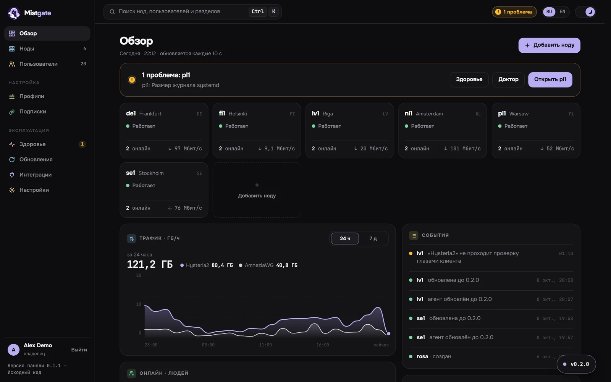
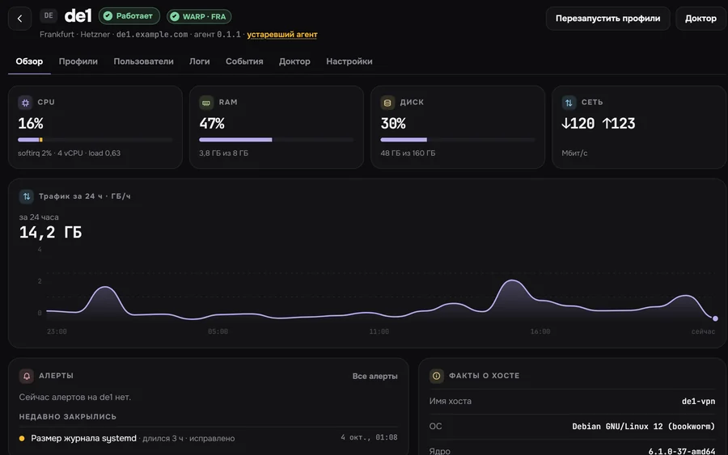
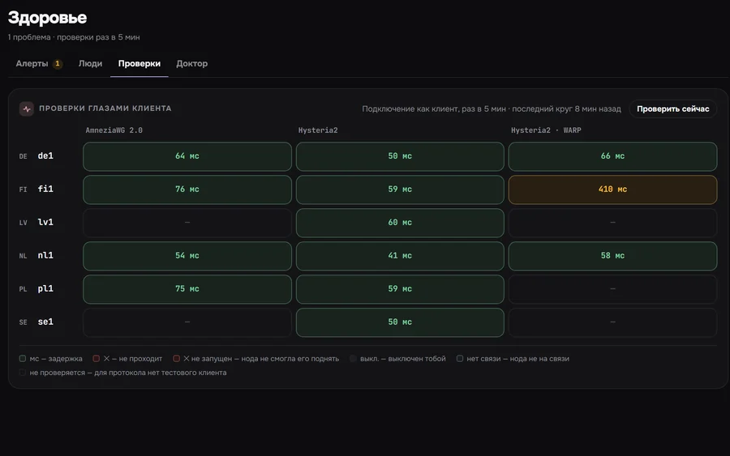
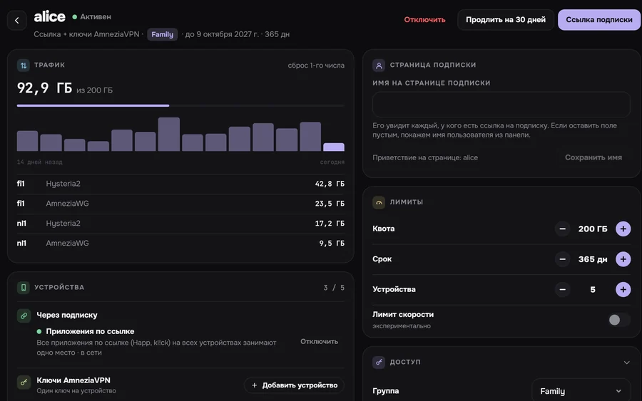
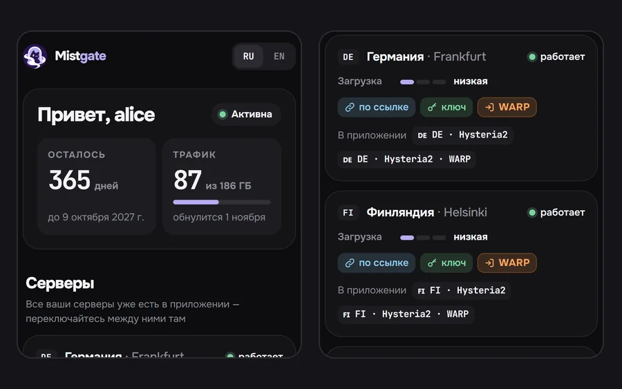

<div align="center">


<h1>Mistgate</h1>

<h3>Свой VPN для своих людей — без возни с серверами.</h3>

<p>Для семьи, друзей, сообщества или небольшой команды.<br>
Hysteria2 и AmneziaWG на ваших серверах, VLESS REALITY на подходе: сервер добавляется из браузера, каждому человеку — одна ссылка, о сбое вы узнаёте первыми.</p>

<p>
<a href="https://github.com/Mistgate/mistgate/releases/latest"></a>
<a href="LICENSE"></a>
<a href="https://github.com/Mistgate/mistgate/actions/workflows/ci.yml"></a>
<a href="go.mod"></a>
</p>

<p><a href="https://mistgate.app/ru/"><b>Документация</b></a> · <a href="#быстрый-старт"><b>Установка</b></a> · <a href="#скриншоты"><b>Скриншоты</b></a> · <a href="#сравнение-с-другими-панелями"><b>Сравнение</b></a> · <a href="README.md">English</a></p>

</div>

<picture>
  <source media="(prefers-color-scheme: dark)" srcset="docs/images/readme/overview-dark-ru.webp">
  <source media="(prefers-color-scheme: light)" srcset="docs/images/readme/overview-light-ru.webp">
  
</picture>

## Зачем Mistgate

Mistgate для тех, кто держит VPN для других людей: семьи, друзей, сообщества или небольшой команды. Вы ставите одну панель, добавляете в неё серверы и отправляете каждому человеку ссылку. Дальше панель сама держит серверы настроенными и проверяет их.

**Одна ссылка на человека, несколько протоколов.**
Приложения на ядре Clash/Mihomo (kl!ck, FlClash, Clash Verge Rev) получают по одной ссылке и серверы Hysteria2, и серверы AmneziaWG. Если в сети у человека заблокируют один протокол, второй уже есть в приложении. Happ получает серверы Hysteria2, а AmneziaVPN берёт ключ для каждого устройства со страницы человека. [Приложения-клиенты](docs/ru/guide/client-apps.md)

**Сервер добавляется из браузера.**
Введите IP и пароль root. Панель запомнит SSH-ключ сервера, проверит его, откроет порты во включённом UFW или firewalld, поставит подписанный агент и дождётся, пока он подключится. Сертификат Let's Encrypt нода получает сама, а кнопка **Включить WARP** даёт ей выход через Cloudflare. [Установка ноды по SSH](docs/ru/getting-started/ssh-install.md)

**Вы узнаёте первым.**
Каждые 5 минут панель подключается к каждому серверу так же, как приложение, и открывает через туннель тестовую страницу. На каждой ноде доктор делает 16 проверок хоста (диск, журнал, резолвер, часы, порты, BBR) и предлагает пять исправлений. Ни одно не запускается без вашего подтверждения. Предупреждения приходят в Telegram. [Здоровье](docs/ru/operations/health.md)

**Лёгкая и незаметная.**
Два статических бинарника на Go: панель и агент ноды. SQLite и systemd, без Docker и без сервера БД. На небольшом тестовом сервере (1 vCPU, 1 ГБ) одна панель в простое занимает 16-20 МиБ приватной памяти (3x-ui 68-74, PasarGuard 262-265, Remnawave 426-454); панель, нода и база вместе на одном сервере с 2 vCPU и 2 ГБ занимают 57 МиБ (у тех же трёх 84, 299 и 707). В этом тесте добавление и удаление пользователей и перезапуск панели не оборвали ни одного соединения, а 3x-ui при смене пользователей перезапускает своё ядро. Посторонний по адресу панели видит сайт-ширму, а админка спрятана за секретным путём или именем хоста. Релизы воспроизводимые и подписаны офлайн-ключом, ноды ставят только подписанные сборки. Защита от торрентов блокирует открытый BitTorrent на ноде; в событии остаются признак и порт назначения, а адреса с ноды не уходят. [Безопасность](docs/ru/operations/security.md) · [Релизы и подпись](docs/ru/operations/releases.md) · [Бенчмарки, в том числе где Mistgate медленнее](docs/ru/reference/benchmarks.md)

**ИИ-агент в помощь.**
В панель встроен MCP-сервер. Claude Code, Codex или другой агент видит флот и меняет его по схеме «план → применить». Установка ноды, исправление доктора и смена пароля сервера ждут, пока вы одобрите их в админке. Ссылки подписок, ключи устройств и пароли агент не получает. [Инструкция для AI-агента](docs/ru/getting-started/ai-agents.md) · [MCP-сервер](docs/ru/reference/mcp.md)

> **Скоро, в релизах этого пока нет:** VLESS REALITY и XHTTP (движок для ноды уже в основной ветке), подписки в форматах Xray JSON и sing-box, установка одной командой, полноценный Telegram-бот для флота и пользователей и бесплатная версия панели на Cloudflare Workers (в разработке).

## Скриншоты

<table>
<tr>
<td width="50%"><picture><source media="(prefers-color-scheme: dark)" srcset="docs/images/readme/node-dark-ru.webp"><source media="(prefers-color-scheme: light)" srcset="docs/images/readme/node-light-ru.webp"></picture><br><sub><b>Нода.</b> Статус, выход через WARP, нагрузка и трафик за сутки.</sub></td>
<td width="50%"><picture><source media="(prefers-color-scheme: dark)" srcset="docs/images/readme/health-dark-ru.webp"><source media="(prefers-color-scheme: light)" srcset="docs/images/readme/health-light-ru.webp"></picture><br><sub><b>Проверки глазами клиента.</b> Каждый протокол на каждой ноде, задержка через туннель.</sub></td>
</tr>
<tr>
<td width="50%"><picture><source media="(prefers-color-scheme: dark)" srcset="docs/images/readme/user-dark-ru.webp"><source media="(prefers-color-scheme: light)" srcset="docs/images/readme/user-light-ru.webp"></picture><br><sub><b>Человек.</b> Квота, срок, устройства и трафик в счёт квоты.</sub></td>
<td width="50%"><picture><source media="(prefers-color-scheme: dark)" srcset="docs/images/readme/phone-dark-ru.webp"><source media="(prefers-color-scheme: light)" srcset="docs/images/readme/phone-light-ru.webp"></picture><br><sub><b>Его ссылка в браузере.</b> Сколько дней осталось, трафик и серверы.</sub></td>
</tr>
</table>

На скриншотах выдуманные демо-данные.

## Быстрый старт

Нужен Linux-сервер (amd64 или arm64) с systemd, домен, который на него указывает (здесь `panel.example.com`), и свободные TCP-порты 80 и 443. На сервере, от root:

```sh
ARCH=amd64    # arm64 на сервере с ARM
for f in "mistgate-linux-$ARCH" SHA256SUMS; do
  curl -fsSLO "https://github.com/Mistgate/mistgate/releases/latest/download/$f"
done
sha256sum --check --ignore-missing SHA256SUMS
install -m 0755 "mistgate-linux-$ARCH" /usr/local/bin/mistgate
mistgate setup --public-url https://panel.example.com             # печатает адрес админки и одноразовую ссылку настройки
mistgate serve --listen :443 --acme-domain panel.example.com      # первый запуск вручную
```

Затем:

1. Запустите `serve` под systemd с юнитом из [Установки панели](docs/ru/getting-started/install-panel.md). Там же описаны секретный хост админки, свой сертификат и свой сайт-ширма.
2. Откройте ссылку настройки и создайте владельца: passkey или пароль с кодом из приложения-аутентификатора.
3. Добавьте серверы в **Ноды → Добавить ноду**, по SSH или одноразовой командой ([Добавление ноды](docs/ru/getting-started/add-node.md)), и дальше по шагам из [Первых пользователей](docs/ru/getting-started/first-users.md).

**Или поручите установку ИИ-агенту.** Claude Code, Codex CLI или любой агент, который умеет запускать `ssh` на вашем компьютере, пройдёт эти шаги сам: скопируйте промпт установки из [инструкции для AI-агента](docs/ru/getting-started/ai-agents.md#установка-mistgate-с-ai-агентом). Он спрашивает перед каждым изменением, а аккаунт владельца вы создаёте сами.

## Сравнение с другими панелями

| | Mistgate | 3x-ui | Remnawave | Hiddify | PasarGuard | s-ui |
|:--|:--|:--|:--|:--|:--|:--|
| Работает без Docker | ✅ | ✅ | ❌ | ✅ | частично | ✅ |
| База данных | SQLite | SQLite или PostgreSQL | PostgreSQL + Redis | MySQL + Redis | SQLite, MySQL, MariaDB или PostgreSQL | SQLite |
| Память панели в простое | 16-20 МиБ¹ | 68-74 МиБ¹ | 426-454 МиБ¹ | не измеряли | 262-265 МиБ¹ | не измеряли |
| Установка одной командой | скоро | ✅ | ❌ | ✅ | ✅ | ✅ |
| Ноду можно добавить из панели (SSH) | ✅ | ❌ | ❌ | ❌ | ❌ | ? |
| Hysteria2 | ✅ | ✅ | частично | ✅ | ✅ | ✅ |
| AmneziaWG | ✅ 2.0 и 3.1 | ✅ 3.1 | ? | ? | ? | ? |
| VLESS REALITY | скоро | ✅ | ✅ | ✅ | ✅ | ? |
| VMess, Trojan, Shadowsocks | ❌ | ✅ | частично | ✅ | ✅ | ✅ |
| Подписки Xray JSON или sing-box | скоро | Xray JSON | ✅ обе | ✅ обе | sing-box | sing-box |
| Проверки и алерты | ✅ проверки глазами клиента, доктор с исправлениями | ✅ монитор туннеля (включается отдельно) | ✅ статус, Prometheus | частично | частично | ? |
| Telegram-бот | только алерты, полный бот скоро | ✅ | частично | ✅ | ✅ | ? |
| Лимит устройств по HWID | только число устройств | ✅ | ✅ | ? | ✅ | ? |
| Встроенный MCP-сервер для ИИ-агентов | ✅ | ? | ❌ | ? | ? | ? |

¹ Приватная память всей группы панели в простое, 0–200 пользователей, без подключённой ноды, на тестовом сервере с 1 vCPU и 1 ГБ (у 3x-ui в группе есть его ядро Xray и fail2ban). Методика, версии и ограничения: [Бенчмарки](docs/ru/reference/benchmarks.md). «?» значит, что в README и документации проекта об этом не сказано.

Другие панели впереди по числу протоколов, размеру сообщества, лимитам по HWID и полноценным Telegram-ботам. Полная таблица с источниками, проверенная 9 октября 2026 года, лежит на странице [Сравнение с другими панелями](docs/ru/reference/comparison.md).

## Статус и планы

Проект молодой. Текущий релиз [`v0.1.32`](https://github.com/Mistgate/mistgate/releases/latest), автор пользуется им в боевой работе. До версии 1.0 ещё могут меняться API, хранимые настройки и протокол ноды. Бинарники для Linux amd64 и arm64 лежат в [GitHub Releases](https://github.com/Mistgate/mistgate/releases/latest).

Дальше: VLESS REALITY и XHTTP, подписки Xray JSON и sing-box, установка одной командой, Telegram-бот для флота и пользователей и версия для Cloudflare Workers. Часть настроек по умолчанию рассчитана на пользователей в России (Яндекс DNS для нод в России, контрольные домены доктора, пресеты split-DNS); всё это меняется в настройках. Подробности и известные ограничения: [Статус и план развития](docs/ru/roadmap/status.md).

## Документация

Вся документация на [mistgate.app/ru](https://mistgate.app/ru/), те же страницы лежат в [`docs/`](docs/README.md). С чего начать:

- [Обзор](docs/ru/getting-started/overview.md) и [Требования](docs/ru/getting-started/requirements.md)
- [Установка панели](docs/ru/getting-started/install-panel.md), [Установка ноды по SSH](docs/ru/getting-started/ssh-install.md), [Первые пользователи](docs/ru/getting-started/first-users.md)
- [Здоровье](docs/ru/operations/health.md), [Обновления](docs/ru/operations/updates.md), [Зашифрованные бэкапы](docs/ru/operations/backups.md), [Решение проблем](docs/ru/operations/troubleshooting.md)
- [CLI](docs/ru/reference/cli.md), [API](docs/ru/reference/api.md), [MCP-сервер](docs/ru/reference/mcp.md), [Архитектура](docs/ru/reference/architecture.md)

## Участие в разработке

Баг-репорты, исправления и правки документации приветствуются. В [CONTRIBUTING.md](CONTRIBUTING.md) (на английском) описаны сборка, устройство кода, проверки CI и соглашения. Coding-агентам начинать с [`AGENTS.md`](AGENTS.md), а в [инструкции для AI-агента](docs/ru/getting-started/ai-agents.md#доработка-кода-с-coding-агентом) есть готовый промпт для доработки кода.

## Безопасность

Об уязвимостях сообщайте закрыто, см. [SECURITY.md](SECURITY.md). Делайте резервные копии каталога данных панели (`/var/lib/mistgate`): там база, мастер-ключ и CA, которому доверяют ноды. [Зашифрованные бэкапы](docs/ru/operations/backups.md) в Cloudflare R2 делают это по расписанию.

## Лицензия

Mistgate распространяется как свободное ПО под [GNU Affero General Public License v3.0 only](LICENSE). Если вы запускаете изменённую панель для других, ссылка «Исходный код» в её админке (`serve --source-url`) должна вести на ваши исходники.
